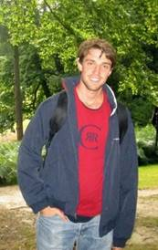

### About Me

&nbsp;

I am a Machine Learning researcher, working at the intersection of deep learning and probabilistic modelling.
I completed a PhD in Machine Learning at the Technical University of Denmark (DTU), supervised by Ole Winther (DTU) and Ulrich Paquet (Google DeepMind).
During my PhD I have done internships at Microsoft Research and Google DeepMind.
Currently, I am the Chief Data Officer at Unumed, working on exciting applications of Machine Learning in healthcare.

&nbsp;

### Main research interests

 - Deep Learning and probabilistic modelling: using deep neural networks to parameterize flexible probabilistic graphical models, focusing in particular on models for sequential data.
 - Bayesian inference: stochastic and deterministic approximation techniques such as variational inference, Markov Chain Monte Carlo methods and sequential Monte Carlo methods.
 - Recommender systems. 

 

