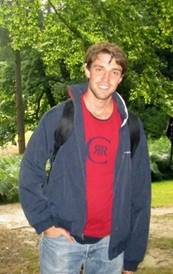

### About Me

&nbsp;

I am the Chief Data Officer at Unumed, where I lead machine learning, analytics, and business intelligence initiatives in healthcare. My work focuses on developing intelligent solutions that improve clinical decision-making and operational efficiency.

I completed a PhD in Machine Learning at the Technical University of Denmark (DTU), where I worked on deep learning and probabilistic modeling. During my doctoral studies, I completed internships at Microsoft Research and Google DeepMind.

&nbsp;

### Areas of Focus

 - Machine Learning in healthcare: applying ML across various applications in health management platforms
 - Analytics and Business Intelligence: transforming healthcare data into actionable insights
 - AI agents orchestration: designing systems that coordinate multiple autonomous agents for complex workflows
 - Deep Learning and probabilistic modeling: building flexible models for complex sequential data

 

